

# 👋 Hi, I'm Lio James Bo

### Aspiring Software Developer · Virtual Assistant · Content Creator

---

## 🧑‍💻 About Me

I'm a **BS Information Systems graduate** with hands-on experience building both desktop and web-based applications. I enjoy crafting clean, functional interfaces and writing well-structured code that solves real-world problems.

My background spans full-stack web development, database-driven systems, WordPress site development, and geospatial monitoring tools. I'm actively seeking opportunities where I can contribute immediately while continuing to grow as a developer.

- 🔭 Currently building: Web projects and expanding my JavaScript skills
- 🌱 Learning: REST APIs, responsive design patterns, and modern CSS frameworks
- 💡 Strengths: Quick learner, detail-oriented, comfortable working independently or in teams
- 📍 Based in the Philippines | Open to remote work

---

## 🛠️ Technical Skills

| Category | Technologies |
|---|---|
| **Languages** | HTML5, JavaScript, PHP, C#, Python |
| **Frameworks** | Django |
| **Databases** | MySQL |
| **Mapping** | Leaflet.js |
| **CMS & Tools** | WordPress, Git, GitHub |
| **Productivity & VA Tools** | Microsoft Excel, Airtable, Google Sheets, Google Docs |
| **Design & Content** | Canva |
| **AI Tools** | ChatGPT, Claude AI, GrokAI |
| **Dev Concepts** | OOP, Role-Based Access Control |
| **Other** | Basic SEO, Page Builders, Plugin Configuration |

---

## 🚀 Projects

---

### 🏢 Apartment Management System — Web Edition

> A full-stack web application for managing apartment operations, built with a multi-role access structure and an integrated FAQ assistant.

**Tech Stack:** `PHP` `MySQL` `JavaScript` `HTML5` `CSS3`

**Key Features:**
- 🔐 **User Authentication** — Secure login system with session handling and role-based access for admin and staff
- 👥 **Tenant Management** — Complete CRUD operations for tenant records including contact info and unit assignments
- 💰 **Payment Tracking** — Monitor rent payments, due dates, and payment history per tenant
- 🤖 **Rule-Based FAQ Chatbot** — Predefined response system that answers common tenant inquiries without human intervention
- 📊 **Admin Dashboard** — Centralized view of occupancy status, pending payments, and system activity

**My Contributions:**
- Designed and implemented the relational database schema in MySQL
- Built the admin dashboard and tenant management modules from scratch
- Developed the rule-based chatbot logic using conditional response mapping
- Implemented session-based authentication and access control
- Wrote front-end UI with vanilla JavaScript for dynamic interactions

**📸 Screenshots**

> *Documented via screenshots. System was developed and tested in a local XAMPP environment. Source code is not publicly available.*

| Admin Dashboard | Tenant Dashboard | Payment Module |
|---|---|---|
| 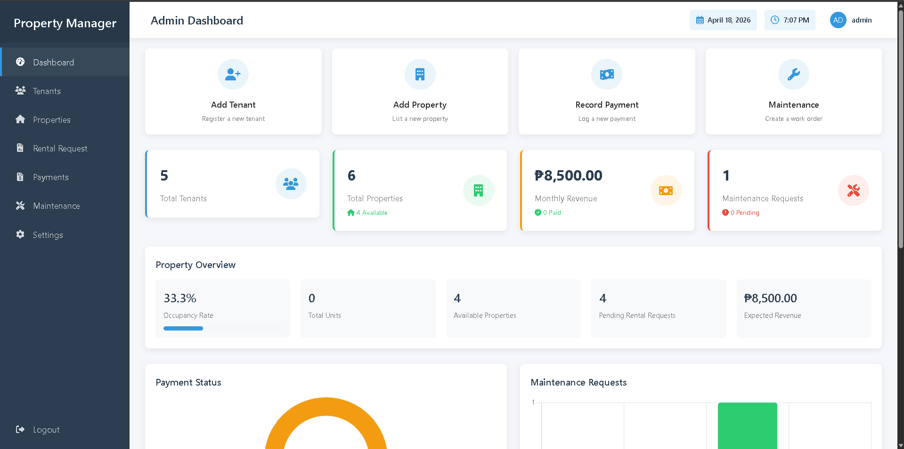 | 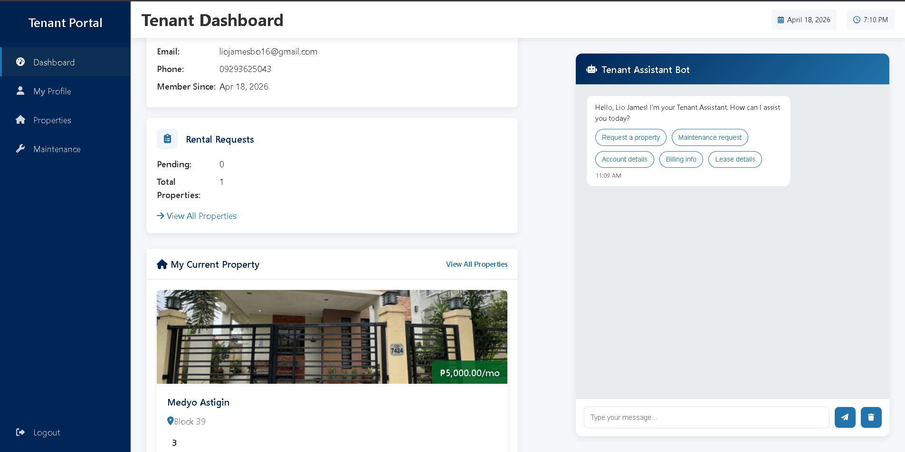 | 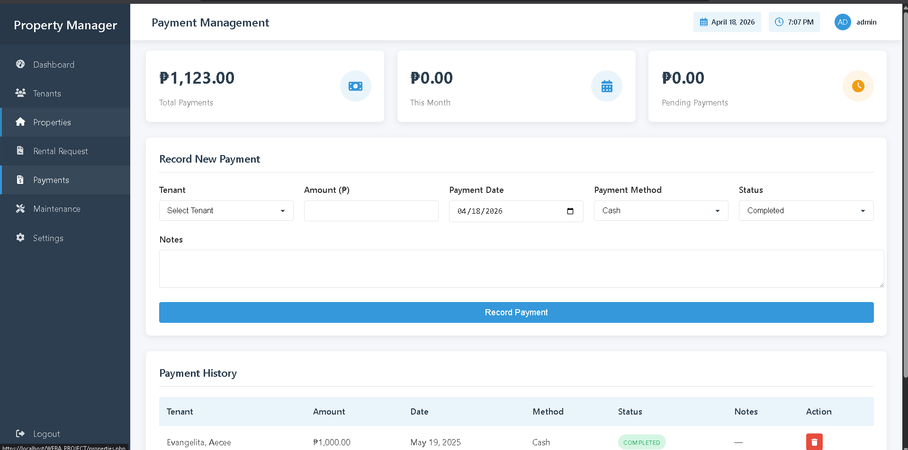 |

---

### 🖥️ Apartment Management System — Desktop Edition

> A Windows Forms desktop application for property managers to handle tenant records and payment tracking offline, with a local database backend.

**Tech Stack:** `C#` `.NET` `Windows Forms` `SQL Server / Local DB`

**Key Features:**
- 📋 **Tenant Record Management** — Add, update, and archive tenant profiles with unit assignment tracking
- 💳 **Payment Tracking Module** — Log and view payment transactions with due date monitoring
- 🗃️ **Database Integration** — Persistent local data storage with structured queries
- 🧩 **OOP Architecture** — Modular class design following object-oriented principles

**My Contributions:**
- Designed the full application architecture using OOP principles in C#
- Built all Windows Forms UI components including data grids, forms, and navigation
- Implemented database connectivity and CRUD operations
- Handled data validation and error handling across all modules

**📸 Screenshots**

> *Documented via screenshots. Source code is not publicly available.*

| Tenant Form | Services Form | In the making |
|---|---|---|
| 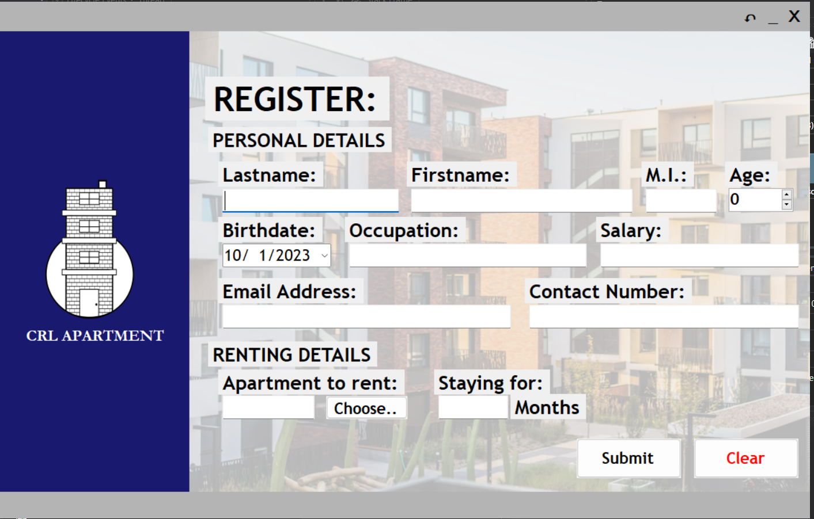 | 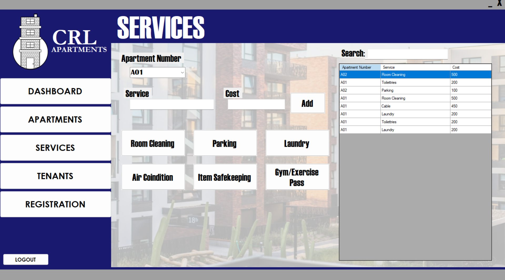 | 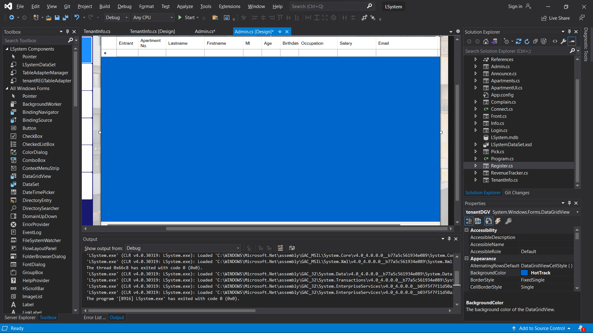 |

---

### 🗺️ Geospatial Farm Monitoring & Status Mapping System

> A web-based monitoring platform developed during my internship at the Provincial Information Technology Office, built with Django and Python. I was solely responsible for the interactive map system and reporting module within a collaborative development team.

**Tech Stack:** `Python` `Django` `PostgreSQL` `JavaScript` `Leaflet.js` `HTML5`

**Key Features:**
- 🗺️ **Interactive Map Visualization** — Fully custom-built geospatial map interface using Leaflet.js, spanning over 7,000 lines of code, rendering geo-tagged farm and livestock locations in real time
- 💉 **Vaccination Tracking** — Log and monitor vaccination schedules and completion status per animal and farm
- 🦠 **Disease Monitoring** — Record and flag disease incidents with status indicators and location tagging
- 📄 **Report Generation** — Custom-built reporting module supporting PDF export, print view, and data import/export
- 🔐 **Role-Based Access Control** — Custom-built authentication system with location-scoped access control; users are restricted to viewing only their assigned area on the map (e.g., a user assigned to Guiguinto can only see Guiguinto data), with differentiated roles for administrators, field officers, and veterinarians
- 🎨 **Theme System** — Supports UI theming for customized display preferences across user roles

**My Contributions:**
- **Solely designed and built the entire map interface** using Leaflet.js — 7,000+ lines of custom JavaScript handling geo-rendering, layer control, and real-time location mapping
- Built a full custom authentication system with location-scoped role-based access control — restricting each user's map view to their assigned municipal area, implemented entirely in Django without third-party auth packages
- Developed the complete reporting module including PDF export, print view, and data import/export functionality
- Integrated Leaflet.js map data with Django views and PostgreSQL database
- Collaborated with the development team on system architecture, testing, and deployment

**📸 Screenshots**

> *Developed during internship at the Provincial Information Technology Office. Screenshots and system details are withheld in compliance with data privacy policies of the organization.*

| Farm Map View | Vaccination Records | Report Module |
|---|---|---|
| 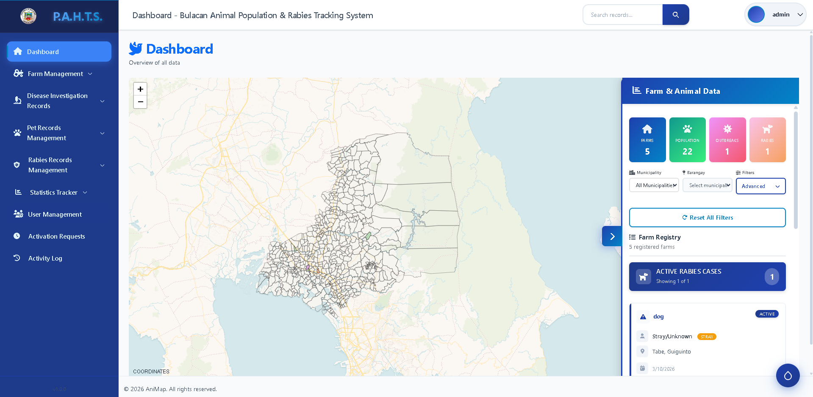 | 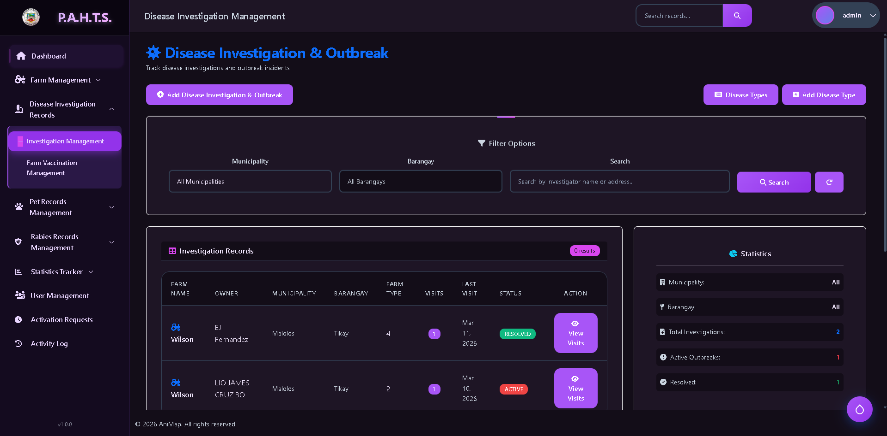 | 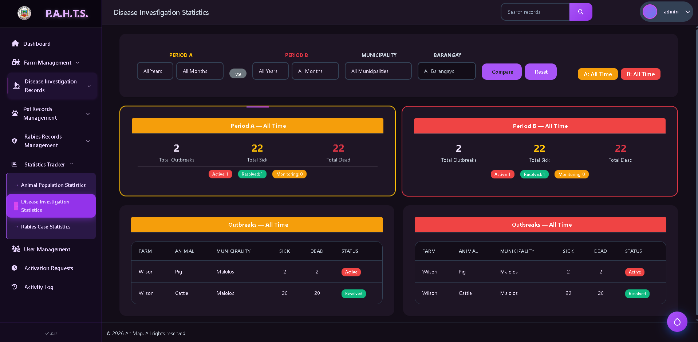 |

---

### 🛒 WordPress Development — Online Store & Resume Site

> Independently built and deployed two WordPress websites from scratch: a functional e-commerce store and a personal resume site — both configured with SEO best practices and live-tested before being taken offline after project completion.

**Tech Stack:** `WordPress` `Elementor / Page Builder` `WooCommerce` `HTML` `CSS` `Basic SEO`

**Project 1 — Online Store**
- Configured WooCommerce for product listings, pricing, and basic checkout flow
- Customized theme to match brand identity including colors, typography, and layout
- Set up product categories, featured items, and navigation menus
- Applied basic on-page SEO: meta descriptions, title tags, alt text for images

**Project 2 — Resume Website**
- Built a responsive personal resume site to present skills, experience, and contact information
- Customized page builder layouts for sections: About, Skills, Projects, and Contact
- Configured contact form plugins and social media integrations
- Optimized page structure and headings following SEO formatting standards

**📸 Screenshots**

> *Both sites were temporarily deployed and are now offline. UI documented via screenshots.*

| Online Store Homepage | Header | Resume Site |
|---|---|---|
| 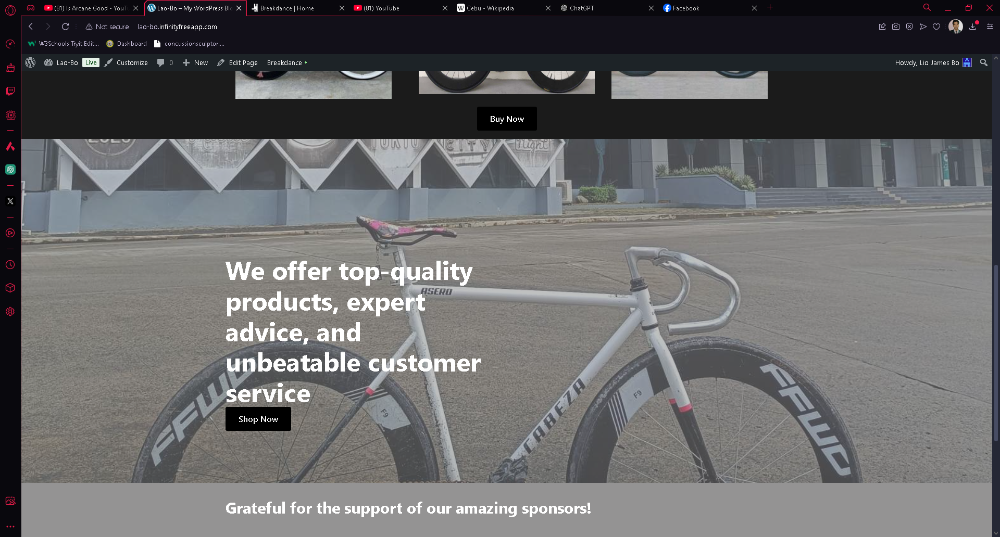 | 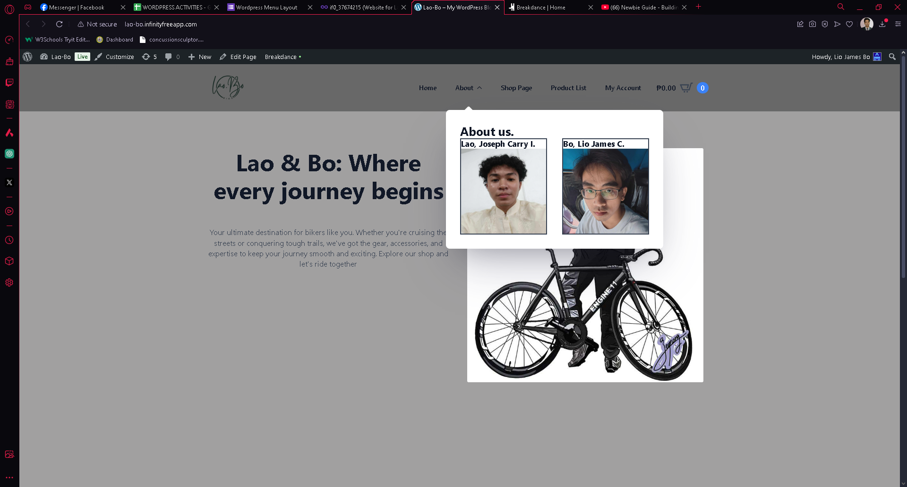 | 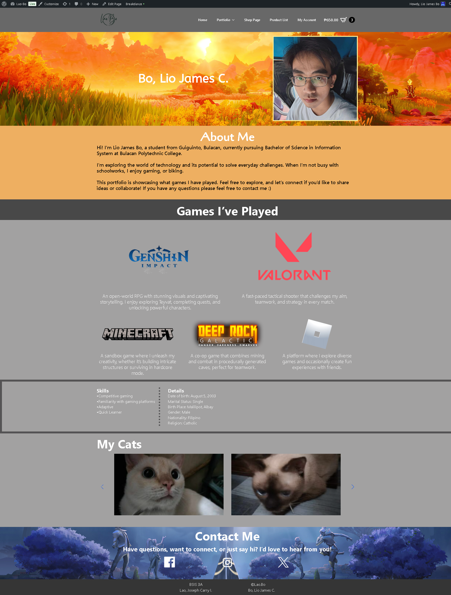 |

---

## 💼 Professional Experience

### Virtual Assistant · Social Media Content Creator
`Freelance` | Remote | 2025

- Created and scheduled social media content across platforms to maintain consistent brand presence
- Assisted clients with day-to-day administrative and digital tasks remotely
- Produced written and visual content aligned with client branding and audience engagement goals

---

### Internship / On-the-Job Training
`Provincial Information Technology Office` · Bulacan, Philippines · August 2025 – November 2025

- Contributed to the development of a **Geospatial Farm Monitoring & Status Mapping System** used by veterinary and agricultural field officers
- Worked on front-end UI components, database queries, and map integration features
- Participated in team stand-ups, testing sessions, and documentation tasks
- Gained hands-on experience in a real development environment with structured workflows

---

### Service Crew
`Chowking` · Philippines · 2023

- Delivered consistent customer service in a fast-paced food service environment
- Handled customer orders, cash transactions, and maintained food preparation standards
- Developed teamwork, time management, and communication skills

---

## 🎓 Education

**Bachelor of Science in Information Systems**
`Bulacan Polytechnic College` · Bulacan, Philippines · 2026

- Relevant coursework: Web Development, Database Management, Systems Analysis & Design, OOP, Software Engineering

---

## 📊 GitHub Stats

> 💡 *Most of my project work was developed in private or offline environments. Visit my **[portfolio site](https://liojamesbo.pythonanywhere.com)** to see detailed project breakdowns.*

---

## 📬 Contact Me

I'm open to junior developer roles, freelance projects, and collaboration opportunities.

| Channel | Details |
|---|---|
| 📧 Email | [liojamesboistech@gmail.com](mailto:liojamesboistech@gmail.com) |
| 💼 LinkedIn | [linkedin.com/in/lio-james-bo](https://www.linkedin.com/in/lio-james-bo-5aa127379/) |
| 📄 Resume | [Download CV](https://drive.google.com/file/d/1dDw4uG1cDL-VWZnOrpr7k_xI4GTeqGFB/view?usp=sharing) |
| 📍 Location | Philippines · Open to Remote |
| 🗣️ Languages | Filipino, English |
| 🌐 Portfolio | [liojamesbo.pythonanywhere.com](https://liojamesbo.pythonanywhere.com) |
---

*Thanks for visiting my profile! Feel free to reach out — I'm always open to new opportunities and conversations.* 🙌

